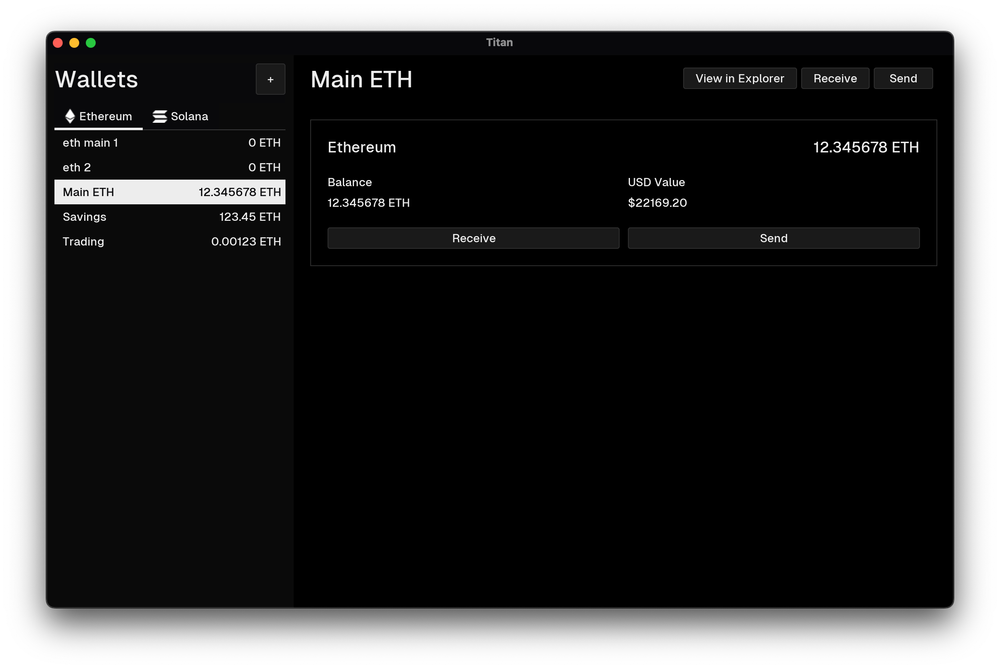

# Titan

[](https://www.gnu.org/licenses/gpl-3.0)

A multichain cryptocurrency wallet and asset management desktop application written in Java.



## Features

- **Multichain Support:** Manage assets across different blockchains (currently Ethereum & Solana).
- **Wallet Management:**
  - Create new wallets securely.
  - Import existing wallets using private keys.
  - View wallet addresses and copy them easily.
  - Securely encrypted wallet storage protected by a user password.
- **Asset Tracking:**
  - View balances in native currency (ETH, SOL).
  - See approximate USD value based on real-time price fetching (via Coinbase API).
- **Transactions:**
  - Send ETH and SOL to other addresses.
  - View transaction links on respective block explorers.
- **Modern UI:** Custom dark theme for a sleek user experience.

## Technology

- **Language:** Java (JDK 17+)
- **UI Framework:** Java Swing
- **Build Tool:** Apache Maven
- **Look and Feel:** [FlatLaf](https://www.formdev.com/flatlaf/) (Core L&F)
- **Blockchain Interaction:**
  - Ethereum: [web3j](https://github.com/LFDT-web3j/web3j)
  - Solana: [sol4k](https://github.com/sol4k/sol4k)
- **Networking:** OkHttp
- **JSON Processing:** Gson

## Look and Feel

Titan uses the excellent FlatLaf library for its base Look and Feel. On top of this, a custom theme named "GeistLaf" is implemented, visually inspired by Vercel's [Geist Design System](https://vercel.com/geist/introduction).

## Installation

The easiest way to run Titan is to download the latest executable `.jar` file from the [**Releases**](https://github.com/kareemv/titan/releases) section of this repository.

Once downloaded, you can typically run it by double-clicking the file (if your system has Java configured correctly) or by using the command line:

```bash
java -jar Titan-VERSION.jar
```

(Replace `Titan-VERSION.jar` with the actual downloaded filename).

If you prefer to build the project yourself, please refer to the [Building](#building) section below.

## Building

This project uses Apache Maven. To build the project and create an executable JAR:

1.  **Prerequisites:**
    - JDK 17 or later
    - Apache Maven
2.  **Clone the repository:**
    ```bash
    git clone https://github.com/kareemv/titan.git
    cd titan
    ```
3.  **Build with Maven:**

    ```bash
    mvn clean package
    ```

    This will compile the code, run tests, and create a JAR file which includes all necessary dependencies.

4.  **Run the application:**

    ```bash
    java -jar target/Titan-VERSION.jar
    ```

    (Replace `Titan-VERSION.jar` with the actual filename).

## License

This project is licensed under the **GNU General Public License v3.0**. See the [LICENSE](LICENSE) file for details.

## Contributing

Contributions are welcome! Please feel free to submit pull requests or open issues.
